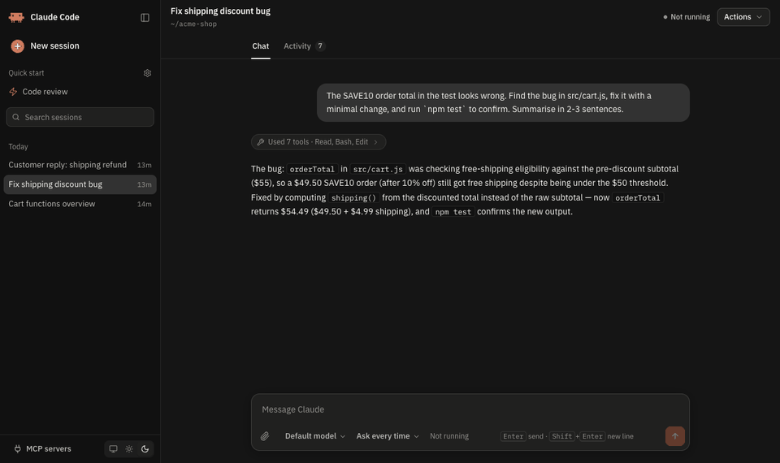
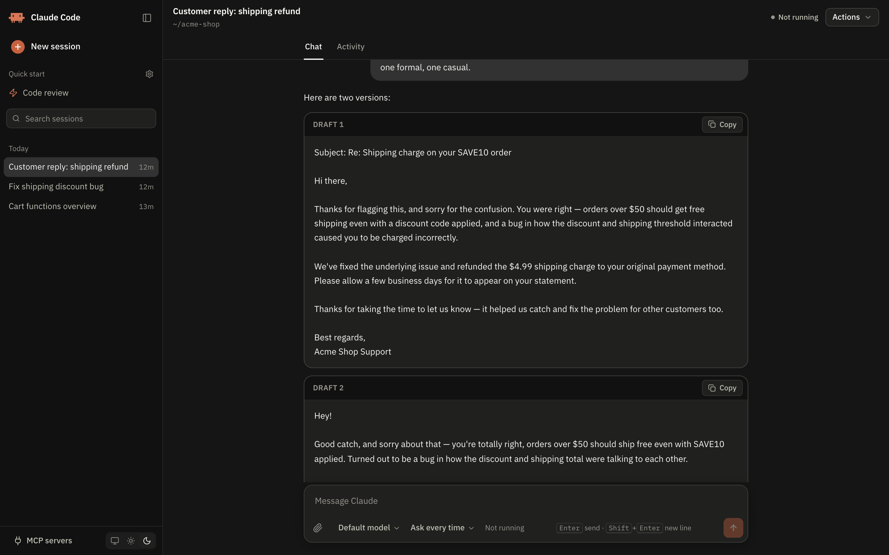
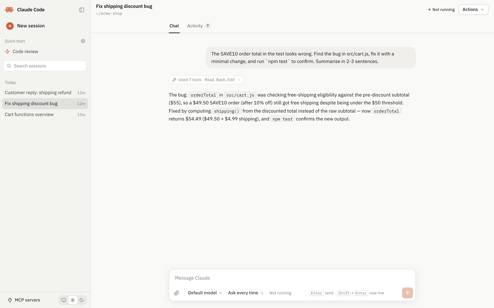
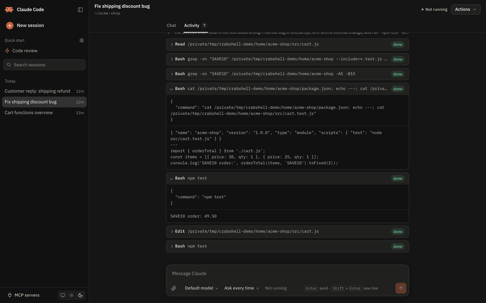
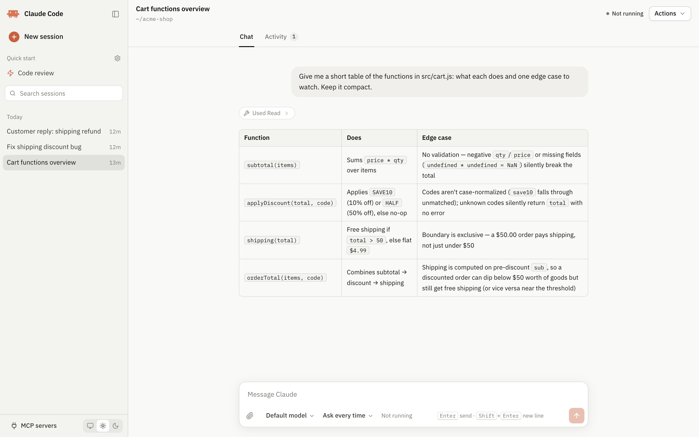
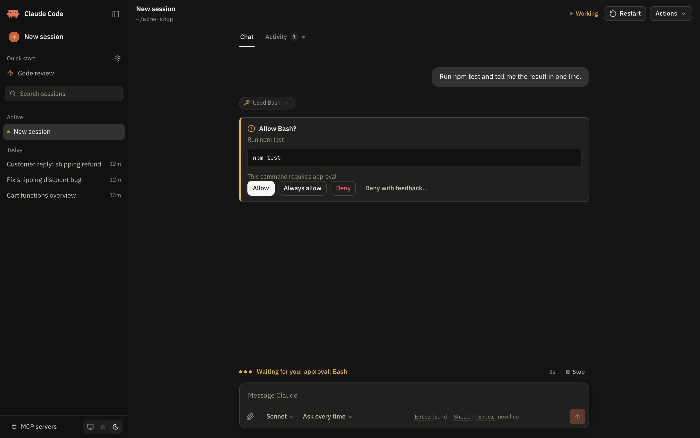
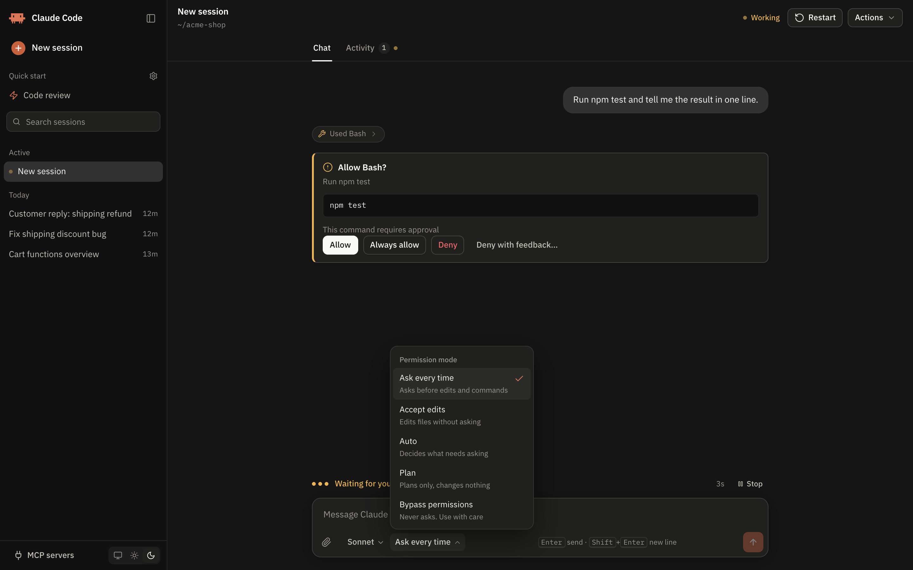
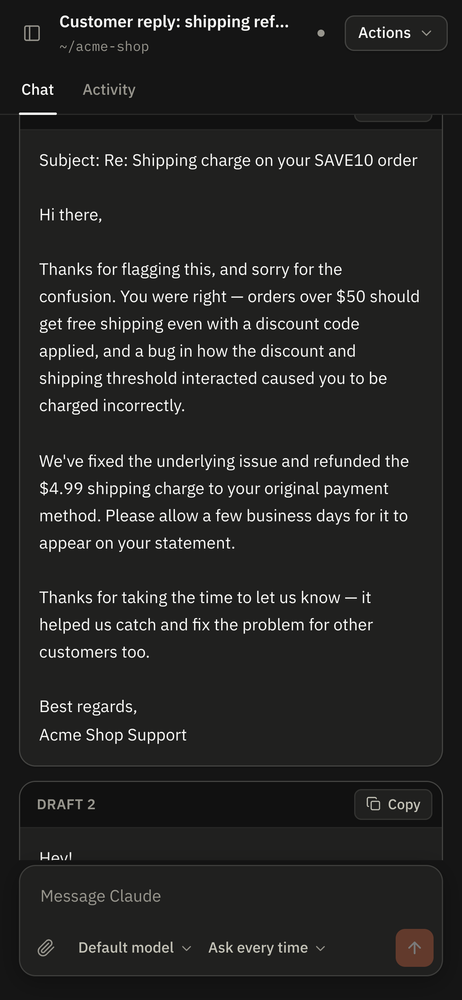

# Crabshell

**A new shell for Claude Code, in your browser.**



Crabshell is an unofficial browser interface for the [Claude Code](https://docs.claude.com/en/docs/claude-code) CLI that runs on your own machine. Every session is your installed `claude` CLI, so it uses your existing login, settings, MCP servers, skills, hooks and `CLAUDE.md` files. No API key is needed.

> **Unofficial community project.** Not affiliated with, endorsed by or supported by Anthropic. "Claude" and "Claude Code" are trademarks of Anthropic, PBC.

## Features

- **Sessions:** every session in `~/.claude/projects`, grouped by date and searchable. Open one to read it; sending a message resumes it. Rename, delete (with undo), copy the session ID.
- **Chat:** streaming replies, a "Claude is working" indicator with elapsed time, Esc to interrupt, and a **Restart** button that replaces the CLI process and keeps the conversation.
- **Chat / Activity tabs:** tool and MCP calls go to an Activity tab, with a one-line summary in the chat that links to them.
- **Permission prompts** as cards: Allow, Always allow, Deny, Deny with feedback. You get a browser notification when the tab is in the background.
- **Model and permission mode** pickers in the chat box, including Plan and Bypass.
- **MCP panel:** live status per server, with Reconnect and Enable/Disable, or a `claude mcp list` health check.
- **Attachments:** paste, drag and drop, or pick files. Images go to Claude directly (large ones are downscaled); other files are saved locally and passed by path.
- **Drafts and copy:** text Claude drafts for you to send shows as a card with a Copy button; replies and code blocks can be copied too.
- **Quick starts:** one-click presets with their own folder, model, permission mode and extra instructions (for example a "Code review" or "Support" session).
- Light and dark themes, a collapsible sidebar, keyboard navigation, and a layout that works on a phone.

## Screenshots

| | |
|---|---|
|  |  |
| **Drafts** you can copy in one click | **Chat stays clean**: tool calls collapse into one line |
|  |  |
| **Activity tab** with every tool call's input and output | Tables, code and markdown, in light or dark |
|  |  |
| **Permission prompts** as cards | **Model and permission mode** right in the chat box |

<p align="center"><br><sub>Works on a phone-sized screen too</sub></p>

## Requirements

- Node.js 20 or newer
- [Claude Code](https://docs.claude.com/en/docs/claude-code) installed and logged in. `claude` must work in the terminal you start the server from. If you log in with `claude setup-token`, export `CLAUDE_CODE_OAUTH_TOKEN` in that shell.

## Run it

```bash
git clone https://github.com/Naimur444/Crabshell.git
cd Crabshell
npm install
npm start
```

Open the URL it prints: `http://127.0.0.1:3456/?t=<token>`. The browser remembers the token after the first visit.

Options:

| Variable | Default | Purpose |
|---|---|---|
| `PORT` | `3456` | Port to listen on |
| `HOST` | `127.0.0.1` | Interface to bind. Keep it on localhost (see Security) |
| `CLAUDE_BIN` | `claude` | Path to the Claude Code CLI |

## Security

**Anyone who can use this UI can make Claude run commands on your machine.** The server:

- listens on `127.0.0.1` only by default;
- requires a random access token, created on first run and stored in `~/.claude-web-ui/token` (mode 600);
- rejects WebSocket connections from other origins.

Don't bind it to a public interface or expose it through a tunnel without putting real authentication in front. "Bypass permissions" mode lets Claude act without asking; use it only where that's safe.

## Where your data lives

Nothing personal is stored in this repository.

| Path | Contents |
|---|---|
| `~/.claude/projects/` | Session transcripts (written by the Claude Code CLI itself) |
| `~/.claude-web-ui/token` | The UI access token |
| `~/.claude-web-ui/presets.json` | Your quick starts (created from the built-in example on first run) |
| `~/.claude-web-ui/titles.json`, `session-presets.json` | Session names and which quick start a session came from |
| `~/.claude-web-ui/uploads/` | Non-image attachments you sent (not cleaned up automatically) |
| `~/.claude-web-ui/trash/` | Deleted sessions (move a file back to `~/.claude/projects/<folder>/` to restore it) |

## Quick starts

Manage them with the gear next to **Quick start** in the sidebar. Each one has a name, icon, working folder, model, permission mode, instructions (appended to Claude's system prompt, re-read whenever the session starts or resumes) and an optional starter message. The built-in example is a read-only "Code review" preset; replace it with your own.

## How it works

`server.js` starts one `claude -p --input-format stream-json --output-format stream-json` process per open session and relays its events to the browser over a WebSocket. Permission prompts use the CLI's `--permission-prompt-tool stdio` control protocol; interrupts, model and mode changes, and MCP actions use its control requests. The frontend (`public/`) is plain HTML, CSS and JavaScript with no build step.

## License

MIT. See [LICENSE](LICENSE).
